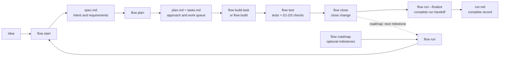

# Flow

**A repo-local evidence layer for AI coding agents.**

AI agents can plan and write code. The hard part is trusting the result after
the chat is gone. Flow records each AI-assisted change as a reviewable trail —
spec, plan, tasks, status, verification, closeout — stored as plain Markdown in
the repository, and refuses to close work whose record does not hold together.

Flow is a local Rust CLI. It does not call an LLM. Each `flow` command prints
an envelope for the active coding host (Claude Code, Codex, or Cursor) to
consume; the host's agent does the thinking, Flow keeps the record honest.

> **Status: v0.1.0 in development.** Flow is an early prototype intended for
> real project use while the command set and artifact grammar are still being
> validated.

## Why Flow

Spec-driven tools structure what goes *into* an agent: constitutions, specs,
plans, steering rules, context files. Flow structures what comes *out*: a
durable account of what was asked, what was planned, what was done, what
verification ran, and whether the work is legitimately complete — addressed to
a reviewer who was never in the session.

Two mechanisms make that more than a pile of generated Markdown:

- **The record covers the whole lifecycle, not just the plan.** Planning
  artifacts in most tools go stale the moment implementation starts. Flow's
  artifacts are a state machine: `status.md` tracks lifecycle and history,
  `flow test` records verification, and `flow close` stamps closeout. The
  repository — not a chat transcript — becomes the source of truth for how the
  change happened.

- **Closeout is gated by deterministic checks, not agent judgment.**
  Requirements (`FR-NNN`), success criteria (`SC-NNN`), and tasks (`T-NNN`)
  are typed and cross-referenced. Flow's drift checks (D1–D3) verify the
  traceability graph in Rust, with stable exit codes, before a change can
  close. An agent cannot declare its own work done.

See [Why Flow](./docs/why-flow.md) for an honest comparison with Kiro,
spec-kit, OpenSpec, Cursor, and Claude Code.

## Quick Start

```sh
cargo install --git https://github.com/oharlem/flow --locked flow-cli

cd your-repo
flow init --host claude-code      # or codex | cursor
flow doctor
```

Then, inside a host session:

```sh
flow start "add login form"   # draft spec.md
flow plan                     # draft plan.md and tasks.md
flow build-task               # implement the next task
flow test                     # tests + D1-D3 traceability checks
flow close                    # stamp the change closed
```

Standalone shell commands update Flow state and print the envelope; they do
not implement code by themselves. Requires a Rust toolchain from
[rustup](https://rustup.rs/). During v0.1.0 development, Flow installs
directly from GitHub with Cargo; a crates.io publish is not required for this
first release line ([ADR-0017](./docs/decisions/0017-cargo-only-install.md)).

## Workflow



Changes move through three states: **drafting → building → closed**. `flow
close` closes the child change; `flow run --finalize` completes the surrounding
run handoff record.

For larger work, `flow roadmap` turns a PRD or notes file into milestones and
`flow run` drives the host through them, one closed, evidence-backed change
per milestone. See
[Your First Roadmap Run](./docs/start-here/02-your-first-roadmap-run.md) and
the full diagram at
[`docs/flow-main-workflow-v0.1.0.png`](./docs/flow-main-workflow-v0.1.0.png).

## Commands

| Command | Purpose |
|---|---|
| `flow init` | Install Flow into the current repo |
| `flow setup` | Add or repair host assets |
| `flow update` | Refresh project bookkeeping and installed host assets |
| `flow doctor` | Check the local Flow installation |
| `flow export-assets --dir <DIR>` | Export embedded defaults for inspection |
| `flow roadmap` | Turn a PRD or notes file into roadmap milestones |
| `flow run [M-N]` | Automate the active roadmap run |
| `flow start [<desc>] [M-N]` | Draft a new change spec |
| `flow amend <change>` | Update the active spec |
| `flow plan` | Draft the implementation plan and task list |
| `flow build` | Implement all remaining tasks |
| `flow build-task [T-NNN]` | Implement one task |
| `flow test` | Run tests and consistency checks |
| `flow close` | Close the active change in place |
| `flow status` | Show current state and next action |
| `flow settings` / `flow set name=value` | Show or store project settings |

See [Commands](./docs/reference/commands.md) for workflow intent and the
[CLI reference](./docs/reference/cli.md) for exact flags.

## The Evidence Trail

Flow stores work under `flow/runs/<run>/`:

- `spec.md` — what to build and why (`FR-NNN`, `SC-NNN`)
- `plan.md` — implementation strategy and documentation impact
- `tasks.md` — dependency-ordered work queue (`T-NNN`, with `Covers:` and
  `Verifies:` references back to the spec)
- `status.md` — Flow-owned lifecycle state and history
- `roadmap.md`, `run.md` — milestone list and run-level state
- `log.md`, `manual.md`, `release-notes.md` — run handoff documents

Every artifact is plain Markdown: diffable, reviewable, and repairable with
ordinary git tools. The exact grammar is embedded in the binary; inspect it
with `flow export-assets --dir /tmp/flow-assets`. For a complete, real
roadmap run that shows checkpoint commits in practice — two milestones, run
handoff docs, and a captured D1 gate refusal — see
[`examples/hello-world-run/`](./examples/hello-world-run/).

## Host Adapters

| Host | Invocation | Installed files |
|---|---|---|
| Claude Code | `/flow-<name>` | `.claude/skills/flow-*/SKILL.md` |
| Codex | `$flow-<name>` | `.agents/skills/flow-*/SKILL.md` |
| Cursor (preview) | `/flow-<name>` | `.cursor/rules/flow.mdc` |

Use `flow setup --host <name>` to add an adapter. The core crate contains no
host-specific logic; adapters only install host files. See
[Host adapters](./docs/hosts.md).

## Guarantees and Boundaries

- **Local-first.** No telemetry, no network calls, one static binary.
- **Git-safe.** Flow never pushes, pulls, fetches, tags, force-resets, or
  calls `gh`/`glab`. Local checkpoint commits happen only on branch-backed
  roadmap runs when `git.run_checkpoint_commits: true`.
- **Not an agent.** Flow is not an AI model, an IDE, a CI system, or a
  replacement for code review. It preserves the evidence those things need.
- **Honest scope.** Flow guarantees the structural integrity of the record —
  IDs resolve, states are legal, gates ran. It does not make agent prose true;
  reviewers still review.

Verify Flow itself:

```sh
cargo test --workspace
cargo fmt --all --check
cargo clippy --workspace --all-targets -- -D warnings
```

## Open Questions

Flow attemps to answer a question the whole industry is working on now, 
and parts of it may be wrong. Things I genuinely don't know yet:

- **Does the evidence get read, or does it become bloat?** Flow was born
  partly from frustration with AI-generated documentation overload. A
  workflow layer that generates more Markdown can overcomplicate the problem it
  set out to fix. The bet is that structured, gated records are different
  from free-form agent prose - but it is a bet.
- **Where does the code/judgment boundary belong?** Drift checks (ex. D1–D3) check traceability
  structure, not meaning. A task can "cover" a requirement on paper and miss
  it in code. How much completion-checking can be deterministic versus left
  to review is unresolved.
- **Will agents maintain the record faithfully over long runs?** Flow
  constrains state transitions, but the quality of the prose in specs, logs, and
  release notes still depends on the host model.
- **Will hosts absorb this layer?** Cursor persists plans. OpenSpec archives changes. 
  A portable, host-neutral evidence format may be a durable seam between tools, 
  but the ecosystem is still evolving. 

If you have opinions on any of these, especially disagreements, please open an
issue or a discussion. That is what this release is for.

## Documentation

Start at [docs/README.md](./docs/README.md). Highlights:
[Why Flow](./docs/why-flow.md) ·
[Your first change](./docs/start-here/01-your-first-change.md) ·
[Drift rules](./docs/drift-rules.md) ·
[Architecture](./docs/architecture.md) ·
[Security](./docs/security.md)

## License

MIT.
