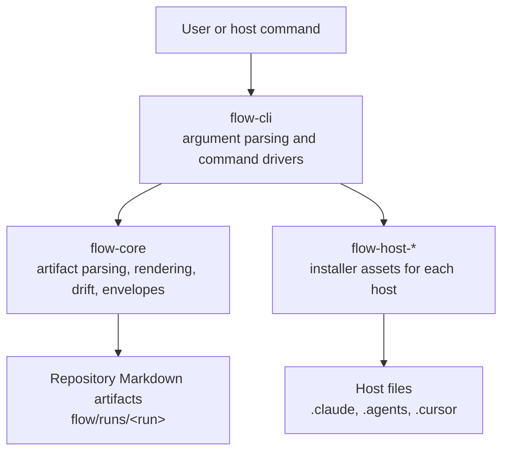
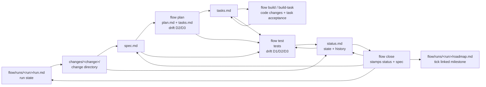
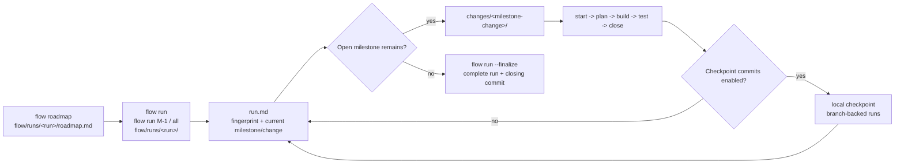

# Flow Architecture

Flow is a single Rust binary that implements a spec-driven development
workflow. The architecture separates host-neutral workflow logic from
host-specific installation details.

## Workspace Layout

```text
flow/
  crates/
    flow-core/              host-neutral parsers, renderers, drift, envelopes
    flow-cli/               binary entrypoint and command drivers
    flow-host-claude-code/  Claude Code adapter
    flow-host-codex/        Codex adapter
    flow-host-cursor/       Cursor adapter (preview)
  assets/
    templates/              seeded project files
    agents/                 embedded phase base prompts
    conventions/            embedded artifact grammar shards
    gitignore.d/            .gitignore fragments
```

## Data Flow



`flow-cli` owns command orchestration and user-facing output. It does not parse
Flow artifacts directly; it calls `flow-core::parse::*`.

`flow-core` owns artifact formats, rendering, drift checks, roadmap helpers,
and envelope composition. It has no host knowledge and does not run an AI
agent.

`flow-host-*` crates own host installation assets. Each adapter embeds its
skill, command, or rule bodies with `include_str!`.

## Artifact Flow



## Run Automation Flow



## Error Model

All `flow-core` entry points return `Result<T, flow_core::Error>`. The CLI maps
errors to stable exit codes:

| Code | Meaning |
|---:|---|
| `0` | Success |
| `1` | Non-blocking finding, such as warnings-only drift |
| `2` | User or workflow error, such as invalid IDs or blocking drift |
| `64` | Environment, config, file, parse, or I/O failure |

## Byte Stability

Templates, envelopes, drift messages, and host-adapter asset bodies are guarded
by golden fixture tests so any unintended change to user-visible output fails
loudly in CI.

## Performance

Flow targets a sub-20 ms cold start for lightweight commands. Measured on an
Apple M3 (`--release`, warm filesystem cache), `flow status` runs in about
22 ms median; nearly all of it is process startup plus two git subprocess
calls. Parsing and drift checking are sub-millisecond at ordinary sizes
(~153 µs to parse a 100-task `tasks.md`, ~327 µs for D1–D3 across it), and
scale linearly to 1,000 tasks. The release profile (fat LTO, one codegen unit,
stripped, `panic = "abort"`) produces a single ~4.5 MB binary.

Reproduce with Criterion:

```sh
cargo bench -p flow-core --bench bench_parsers
```

A 2x regression on parser, drift, or render benchmarks should block release
work until the cause is understood. Benchmarks are local tools, not part of
the default CI matrix.
