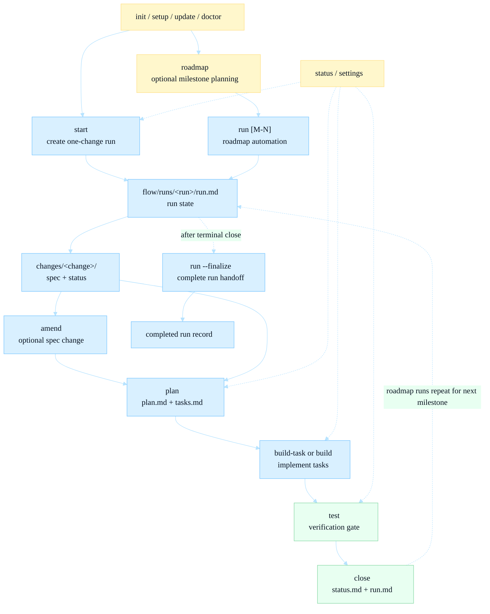

# Commands

This page owns command intent: which `flow <command>` to run, when to run it,
and what it changes. For exact flags and generated syntax, read
[CLI reference](./cli.md).

Host syntax is only a wrapper around the same command intent:

- Codex: `$flow-<name>`
- Claude Code, Cursor: `/flow-<name>`
- Shell: `flow <name>`

## Command Map

## Setup And Health

| Command | Use it when | Main effect |
|---|---|---|
| `flow init [--host <hosts>]` | A repo is not Flow-enabled yet | Creates `.flow/`, `flow/`, default config/state, and optional host assets |
| `flow setup [--host <hosts>]` | You are adding or repairing host assets | Installs or updates host files under `.claude/`, `.agents/`, or `.cursor/` |
| `flow update` | The installed `flow` binary changed | Refreshes `.flow/version`, config defaults, detected host assets, and Flow-owned AGENTS notes |
| `flow doctor` | You want an install sanity check | Reports missing structure and generated-doc drift warnings |
| `flow export-assets --dir <DIR>` | You want to inspect embedded defaults | Writes convention shards and base prompts to a directory you choose |

`flow init`, `flow setup`, and `flow update` are idempotent. They preserve
project config, local prompt overrides, user-owned `AGENTS.md` content, and
change artifacts. Generated default assets are only refreshed when they exactly
match the embedded copy that replaces them.

The installed `flow` executable must be available on `PATH`; during v0.1.0
development, install it with
`cargo install --git https://github.com/oharlem/flow --locked flow-cli`. See
[Host adapters](../hosts.md). Default conventions and base phase prompts are
embedded in the binary.

## Roadmap And Automation

### `flow roadmap`

Use `flow roadmap [<source>] [--append | --replace]` to turn a PRD, notes file,
inline text, or stdin into milestones in a planned run at
`flow/runs/<run>/roadmap.md`.

Key behavior:

- It is host-assisted. Direct shell use without `FLOW_HOST` fails before
  printing the agent prompt.
- It creates the planned run immediately, including `run.md`, `roadmap.md`,
  `changes/`, `log.md`, `manual.md`, and `release-notes.md`.
- Missing path-like sources fail clearly instead of being treated as inline
  text.
- Milestones use `### [ ] M-N: <title>` headings under `## Milestones`.
- `--append` appends. `--replace` replaces after the configured confirmation
  behavior allows it.
- `--finalize` validates the run-local roadmap, refreshes `run.md`,
  and advances the `.flow/state.yaml` milestone counter.
- Milestone IDs are variable-width and unpadded, such as `M-1` and `M-12`.
  Generation scans existing run-local roadmaps before allocating IDs.

### `flow run`

Use `flow run` to start or continue the active planned/running roadmap run; it
automates every open milestone captured at run start. Pass `flow run M-N` to
automate just that one milestone instead. If exactly one active roadmap run
exists, Flow selects it automatically; multiple active runs require
`FLOW_RUN_DIR` or an explicit run directory.

Each run creates `flow/runs/YYYYMMDD-roadmap-<run-slug>/` with:

- `run.md` - run-level state, current change, next command, and change index
- `log.md` - trace of decisions, actions, stops, tests, and handoffs
- `manual.md` - owner manual for the resulting state
- `release-notes.md` - delta-oriented summary of delivered changes
- `roadmap.md` - run-local milestone list and final checked roadmap state
- `changes/<change>/` - child change artifacts for one-off or milestone work

By default, `flow run` creates one local run branch for the roadmap lifecycle.
Set `git.run_branch=false` before creating a planned run when a branchless run
is required. When `git.run_checkpoint_commits: true`, branch-backed runs require
a clean worktree and create local checkpoint commits after each milestone
closes; `flow run --finalize` then commits the finalized run workspace so a
completed run leaves a clean worktree. Flow never pushes, pulls, fetches,
creates tags, or calls GitHub/GitLab CLIs.

Use `flow run --resume <run-dir>` after an interruption to print the next safe
command from `run.md`. Use `flow run --rescan` after intentional run-local
roadmap edits to refresh the run fingerprint and milestone snapshot before
continuing.

When every roadmap milestone is complete, `flow run --finalize` validates the
run handoff documents and marks the run complete. Handoff requirements are
tiered by `Run scope` (recorded in `run.md` at attach time): `flow run all`
runs (and any roadmap run that touches more than one distinct milestone)
require complete `log.md`, `manual.md`, and `release-notes.md`; one-off runs
and single-milestone runs require only `release-notes.md`. The final checked
roadmap stays in the run directory; there is no root roadmap reset. The run
finalize footer follows `review.before_finalize` and
`review.per_command.run`; there is no separate run-level auto-finalize
setting.

## Change Workflow

**Review modes:** With `review.before_finalize: false` (default), Flow suppresses the
printed finalize footer; the agent runs the command shown as `**Save state with**` in
the envelope when artifacts are ready. The envelope always carries the canonical
finalize command, including dynamic arguments such as the active task ID for
`build-task`. With `true`, the printed footer is the review checkpoint.
`build` and `build-task` may chain internally to verification when all tasks are
complete, skipping a separate `flow test` prepare envelope.

### `flow start`

Use `flow start [<description>] [M-N]` to create a one-off run when needed,
create a change branch, and seed `spec.md` plus `status.md` under
`flow/runs/<run>/changes/<change>/`. Inside a roadmap run, set
`FLOW_RUN_DIR=<run-dir>` before calling `flow start M-N` so the milestone is
resolved from the run-local roadmap.

With a milestone ID, Flow uses the run-local roadmap title for the change name
and adds `**Milestone**: M-N` to `status.md`. Without a milestone ID, Flow
derives a short slug from the description. Supplying more than one milestone ID
is an error.

### `flow amend`

Use `flow amend <change>` to revise the active `spec.md`. Use
`flow amend --ask "Q" --answer "A"` to append a clarification Q/A pair. Amend
does not edit roadmaps, create `tasks.md`, or change the change
state.

### `flow plan`

Use `flow plan` after the spec is approved. The plan agent writes:

- `plan.md`, including `## Summary`, `## Technical Context`, and
  `## Documentation Impact`
- `tasks.md`, with small dependency-ordered tasks

Finalize validates task metadata, runs planning drift checks, and records
`plan-complete` in `status.md`.

`## Documentation Impact` must either name the `flow/docs/**` pages to update
or declare `Impact: none` with a `Docs already current because ...` rationale.
Closeout evidence is based on changed files under the configured Flow docs path
unless that no-docs rationale is present.

### `flow build` And `flow build-task`

Use `flow build` to implement all runnable open tasks. Use
`flow build-task [T-NNN]` to implement exactly one task.

The build agent works test-first for automated work. After implementation, task
state flows through:

- `[ ]` - not implemented
- `[~]` - implemented and awaiting acceptance
- `[x]` - accepted and saved by Flow

`[~]` does not satisfy dependencies and does not count as complete for
`flow test` or `flow close`.

When `flow build` accepts the final task, it immediately runs the same
verification gate as `flow test`. `flow build-task` routes to `flow test` after
the final task is accepted.

### `flow test`

Use `flow test` to rerun the verification gate before closeout, especially
after `flow build-task`, after a failed final build verification, or whenever
`status.md` lacks a `build-complete` history entry.

The gate runs:

- `.flow/config.yaml: test.command`, when configured
- otherwise a safe auto-detected runner where available, such as
  `cargo test --workspace`
- D1/D2/D3 drift checks

D1/D2/D3 block closeout.

### `flow close`

Use `flow close` after verification passes. It:

- stamps `**Closed**: <date>` in `spec.md`
- verifies documentation evidence or an explicit docs-current rationale
- leaves the child change directory in place
- updates `run.md` with the closed change and next command
- stamps `status.md` with `State: closed`
- ticks a linked run-local roadmap milestone, when present
- removes per-change scratch state (`.flow-test.last.md` and the
  `.flow/` build-pending directory) from the change directory

`flow close` does not bump versions, edit package manifests, commit, tag,
merge, push, pull, fetch, or call GitHub/GitLab CLIs.

## State, Routing, And Settings

| Command | Purpose |
|---|---|
| `flow status [--change-dir <dir>]` | Show change state, recent history, consistency findings, and next action |
| `flow settings` | Print effective project settings |
| `flow set name=value` | Persist one setting |

`flow status` is read-only for artifacts and does not write `.flow-test.last.md`. Run `flow test` to refresh that drift cache.

Supported `flow set` assignments:

- `confirmation=yes|no`
- `prefix=<dir>`
- `counter=<n>`
- `run_branch=true|false`
- `run_checkpoint_commits=true|false`

`confirmation: no` is the default. With that setting, phase agents run printed
state-save commands directly after writing artifacts. With
`confirmation: yes`, they ask before running the printed finalize command.

## Safety Guarantees

Flow never runs `git push`, `git pull`, `git fetch`, `gh`, or `glab`. Flow never
creates tags or performs destructive git operations. Its only commit-creating
behaviors are the local checkpoint commits made by a branch-backed roadmap run
when `git.run_checkpoint_commits: true`, plus the closing commit of the run
workspace that `flow run --finalize` makes under the same setting.

On protected branches (`main`, `master`, `trunk`, `develop`, `release/*`),
Flow warns before branch-creating commands. Set `FLOW_FORCE_ON_PROTECTED=1`
when you intentionally want to skip that prompt.
